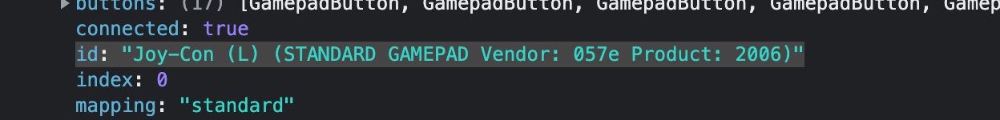
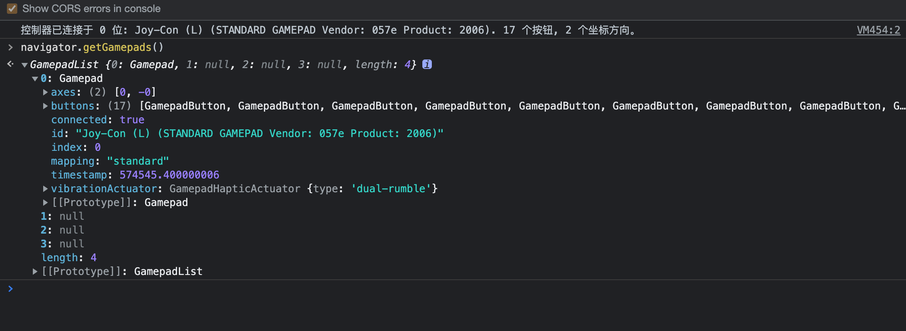

# GamePad API

1. web hid & gamepad 的 API 使用

## web hid

> The **`HID`** interface provides methods for connecting to *HID devices*, listing attached HID devices and event handlers for connected HID devices.

通过 web hid 和外设建立连接的步骤

1. 拿到外设的 vendorId & productId，通过 `navigator.hid.requestDevice` 获得设备的引用
2. device open
3. 启用/禁用设备的一些能力，给设备发送信息，比如说震动，还有一些其它的模式
4. 处理设备的输入。这个时候要处理设备发过来的数据包，看起来很复杂

几个问题：

1. 如何拿到外设的 vendorID & productId

   通过 `navigator.getGamePads()`可以拿到

   

2. 启用、禁用设备能力时的 commandId 怎么获得

3. 设备输入是的数据包长啥样，如何处理

- [ ] 尝试一下通过代码连接 joy con 

## Gamepad（手柄）

> The **Gamepad API** is a way for developers to access and respond to signals from gamepads and other game controllers in a simple, consistent way. It contains three interfaces, two events and one specialist function, to respond to gamepads being connected and disconnected, and to access other information about the gamepads themselves, and what buttons and other controls are currently being pressed.

```javascript
window.addEventListener("gamepadconnected", function(e) {
  console.log("控制器已连接于 %d 位: %s. %d 个按钮, %d 个坐标方向。",
    e.gamepad.index, e.gamepad.id,
    e.gamepad.buttons.length, e.gamepad.axes.length);
});
```

当通过蓝牙连接 joy-con L 时，console 中打印如下：



demo: https://developer.mozilla.org/en-US/docs/Web/API/Gamepad_API/Using_the_Gamepad_API

gamepad API 的兼容性要比 web HID 好的多


