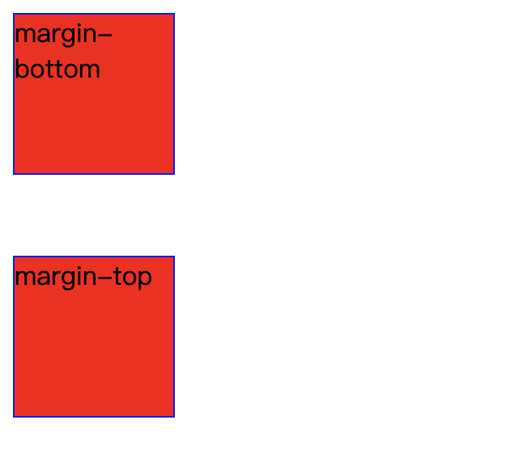
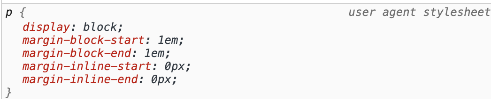

# 边距


本文中的边距指 margin 和 padding 

## 目的

1. 理解 margin 和 padding 作用在块级盒子和内联盒子中的表现，包括负的 margin

2. 理解百分比 magin 和 padding 的值取决于什么

3. 理解外边距折叠

## 边距对盒模型的作用

盒模型分为两类：块级盒子和内联盒子，当边距作用于这两种不同的盒子时的效果不太一样。

**块级盒子**

- 正的边距会将其他盒子从该盒子周围 **”推开“** 
- 负的 margin 会使其他元素向该盒子 **”收缩“**

**内联盒子**

- 垂直方向的正边距会被作用但是**不会**把其他元素从该盒子周围 **“推开”**， 负 margin 会被作用但是**不会**使其他元素向该盒子 **“收缩”** 
- 水平方向的正边距会被作用同时**会**把其他元素从该盒子周围 **“推开”**，负 margin 会被作用同时**会**使其他元素向该元素**“收缩”**

> “推开” 可以理解为其他元素与盒子的内容部分的距离变大，同理，“收缩”可以理解为缩小。
>
> BTW，padding 不能为负数

可以知道，边距作用在内联盒子的垂直方向时，不会生效，有没有一种方法让其生效？有！！，将其声明为 `inline-block`

`inline-block`是一种特殊的盒模型，它混合了块级盒子和内联盒子的特征：

- 不换行
- 可以设置宽高
- 垂直方向的边距可以生效

## 百分比边距

接下来探讨一下百分比边距的参考值是什么。

结论：各个方向的百分比边距都参考最近的父级元素的**内容部分**的宽度，这个宽度必须是元素本身定义的或者继承而来的。如果元素的宽度由子元素决定，则继续向上层查找，直到 `body`

```html
    <div class="block">
      <div class="inner-block"></div>
    </div>
```

```css
.block {
  width: 100px;
  height: 100px;
  background: indianred;
  border: 1px solid blueviolet;
}

.inner-block {
  width: 10px;
  height: 10px;
  background: blue;
  border: 1px solid blueviolet;
  padding: 10%;
  margin: 10%;
}
```

上述代码中， class 为 `inner-block` 的盒子的 padding 各个方向都为 10px，margin 也是。但是将其盒子模型改为 IE 盒模型呢？

```css
.block {
  width: 100px;
  height: 100px;
  background: indianred;
  border: 1px solid blueviolet;
+ box-sizing: border-box;
+ padding: 49px;
}
```

此时 class 为 `inner-block` 的盒子父级元素的内容宽度为0，所以 padding 和 margin 都为 0。

结论中提到的 「这个宽度必须是元素本身定义的或者继承而来的。如果元素的宽度由子元素决定，则继续向上层查找，直到 `body`」 经过测试是这样的，但是在 W3C 规范中提到 margin 的百分比值时：

> The percentage is calculated with respect to the *width* of the generated box's [containing block](https://www.w3.org/TR/CSS21/visuren.html#containing-block). Note that this is true for ['margin-top'](https://www.w3.org/TR/CSS21/box.html#propdef-margin-top) and ['margin-bottom'](https://www.w3.org/TR/CSS21/box.html#propdef-margin-bottom) as well. **If the containing block's width depends on this element, then the resulting layout is undefined in CSS 2.1.**

翻译一下最后一句话就是：

如果「包含块」的宽度取决于子元素，则结果是 undefined。

出现这个的结果的原因是可能是我没有找到最新的规范。。。又或者我对这句话的理解出现了问题

```html
    <span class="inline-container">
        <span> maiores dignissimos necessitatibus. Vel numquam reiciendis alias.</span>
        <span>shaben Lorem ipsum </span>
    </span>
```

```css
.inline-container span {
  padding: 20%;
}
```

上述代码的结果是 inline-container 中的两个 span 元素的 padding 是 body 宽度的 20%。当设置 inline-container 盒子类型为 inline-block 并且加上固定的宽度 100px，其内部的两个子元素的 padding 就是 20px。

**为什么取决于父元素的宽度？**

css 权威指南中这样解释：

> *我们认为，正常流中的大多数元素都会足够高以包含其后代元素（包括外边距），如果一个元素的上下外边距是父元素的height的百分数，就可能导致一个无限循环，父元素的height会增加，以适应后代元素上下外边距的增加，而相应的，上下外边距因为父元素height的增加也会增加，形成无限循环。”*

## 外边距折叠

> 块的[上外边距(margin-top)](https://developer.mozilla.org/zh-CN/docs/Web/CSS/margin-top)和[下外边距(margin-bottom)](https://developer.mozilla.org/zh-CN/docs/Web/CSS/margin-bottom)有时合并(折叠)为单个边距，其大小为单个边距的最大值(或如果它们相等，则仅为其中一个)，这种行为称为**边距折叠**。

例如：

```html
 <div class="block margin-bottom">margin-bottom</div>
 <div class="block margin-top">margin-top</div>
```

```css
.block {
  width: 100px;
  height: 100px;
  background: red;
  border: 1px solid blue;
}

.margin-bottom {
  margin-bottom: 49px;
}

.margin-top {
  margin-top: 50px;
}
```

结果是：



很显然，两个盒子的 margin 只应用了一个，因为两个 margin 作用于相同的位置，导致外边距折叠。

**那么外边距折叠是什么情况才会发生呢？**

- 同一层相邻两个元素之间会发生外边距重叠，除非后一个元素使用 clear-fix 清除浮动
- 没有内容（border，padding）将父元素和后代元素分开
- 空的块级元素

> 只有普通流（in flow) 才会出现外边距重叠。只要不是 `float`、`absolutely positioned` 和 `root element` 时就是 in flow

**为什么要有外边距重叠呢？**

外边距重叠的出现是解决段落之间的边距问题。因为 p 标签有默认的 margin，多个 p 标签在一起时，如果没有外边距重叠，会造成 p 标签之间的间隔是第一个 p 标签的 margin-top 的 2 倍。

chrome 中 p 标签的默认样式：



所以我们开发时也可以利用外边距重叠来解决类似的问题，而不是用 css 选择器。

## 负边距的应用

**解决两个相邻的 inline（包括 inline-block） 元素排列时有一个间隙**

```html
    <span>代娃</span>
    <span>代娃</span>
```

如下图所示，两个 span 元素中间有一个空隙，这个是规范定义的，但是有时候并不需要这个空隙，可以利用负边距来解决它。


```css
span:nth-child(1) {
  margin-right: -10px;
}
```

online demo：[代码](https://codesandbox.io/s/shengbeibuju-pjco7?file=/index.html)

关于这个问题的更多解决办法见[去除inline-block元素间间距的N种方法](https://www.zhangxinxu.com/wordpress/2012/04/inline-block-space-remove-%E5%8E%BB%E9%99%A4%E9%97%B4%E8%B7%9D/)

## 参考文章

[深入理解CSS外边距折叠（Margin Collapse）](https://segmentfault.com/a/1190000010346113)

[外边距重叠- MDN](https://developer.mozilla.org/zh-CN/docs/Web/CSS/CSS_Box_Model/Mastering_margin_collapsing)