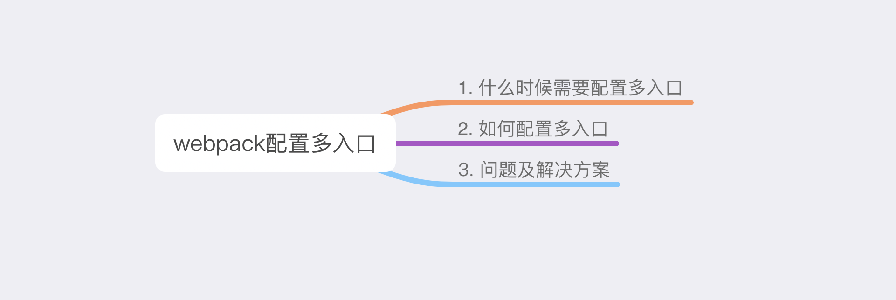

# webpack 配置多入口

webpack 作为前端经常使用的打包工具，但是其配置的繁琐程度往往让人望而生畏，下面整理一下在 CRA 中配置 webpack多入口时的一些内容，希望通过积累来达到对 webpack 的熟练使用



## 什么时候需要配置多入口

:warning: 在想到配置多口之前，我们需要弄清楚是否真的有必要配置多入口。

下面介绍一下我的应用场景以及配置多入口的原因。

场景：

- 两种用户，普通用户和管理员
- 两种用户都可以访问一个公共的模块页面
- 一个人从0⃣️开发

根据以上场景，需要配置多入口的原因：

**减少用户端/管理员端的打包📦体积，同时能复用一些组件、模块**

总的来说，配置多入口是一种减少应用打包体积的手段，但是需要我们根据业务场景以及配置多入口带来的复杂度来决定配置多入口是否合理

## CRA 中配置多入口

> CRA version: 3.4.1

### 修改 entry 为对象写法

webpack 的 entry 配置有多种写法，对象写法告诉 webpack 将每一个 entry point 独立进行打包（独立的依赖图）。

```js
// webpack.config.js
    entry: {
      pageOne: isEnvDevelopment && !shouldUseReactRefresh
              ? [
                  webpackDevClientEntry,
                  paths.pageOneIndexJs,
                ]
              : paths.pageOneIndexJs,
      pageTwo: isEnvDevelopment && !shouldUseReactRefresh
              ? [
                  webpackDevClientEntry,
                  paths.pageTwoIndexJs,
                ]
              : paths.pageTwoIndexJs,
    }
```

### 修改 output.filename

Output.filename 在单入口是可以是静态的，比如 `bundle.js`，但是在多入口时，需要给每个 bundle 赋予一个唯一的名称

```js
// webpack.config.js
      filename: isEnvProduction
            ? 'static/js/[name].[contenthash:8].js'
            : isEnvDevelopment && 'static/js/[name].bundle.js',
```

### 新增一个 HtmlWebpackPlugin

因为需要生成两个 html 文件，所以需要新增一个 HtmlWebpackPlugin，同时指明生成的 html 文件的名称。

```js
// webpack.config.js
plugins: [
        new HtmlWebpackPlugin(
        Object.assign(
          {},
          {
            inject: true,
            chunks: ['pageOne'],
            filename: 'pageOne.html',
            template: paths.appHtml,
          },
          isEnvProduction
            ? {
                minify: {
                  removeComments: true,
                  collapseWhitespace: true,
                  removeRedundantAttributes: true,
                  useShortDoctype: true,
                  removeEmptyAttributes: true,
                  removeStyleLinkTypeAttributes: true,
                  keepClosingSlash: true,
                  minifyJS: true,
                  minifyCSS: true,
                  minifyURLs: true,
                },
              }
            : undefined
        )
      ),
      new HtmlWebpackPlugin(
        Object.assign(
          {},
          {
            inject: true,
            chunks: ['pageTwo'],
            filename: 'pageTwo.html',
            template: paths.appHtml,
          },
          isEnvProduction
            ? {
                minify: {
                  removeComments: true,
                  collapseWhitespace: true,
                  removeRedundantAttributes: true,
                  useShortDoctype: true,
                  removeEmptyAttributes: true,
                  removeStyleLinkTypeAttributes: true,
                  keepClosingSlash: true,
                  minifyJS: true,
                  minifyCSS: true,
                  minifyURLs: true,
                },
              }
            : undefined
        )
      ),
]

```

### 修改 ManifestPlugin.generate 的内部逻辑

经过以上的配置后，兴冲冲的`yarn start`,然后发现控制台中一直显示 `Starting the development server...` ，没有后续了，最让人疑惑的是没有一点后续，经过多番查找，发现是 ManifestPlugin.generate 的内部逻辑有些 bug，并且错误应该没有被捕获，修改为支持多入口的即可。

```js
// webpack.config.js
plugins: [
  
        new ManifestPlugin({
        fileName: 'asset-manifest.json',
        publicPath: paths.publicUrlOrPath,
        generate: (seed, files, entrypoints) => {
          const manifestFiles = files.reduce((manifest, file) => {
            manifest[file.name] = file.path;
            return manifest;
          }, seed);
          let entrypointFiles = [];

          let filterUnMap = function (entryFiles){
            return entryFiles.filter(
                fileName => !fileName.endsWith('.map')
            );
          };
          // 遍历所有入口文件生成然后再加入entrypointFiles
          Object.keys(entrypoints).forEach(entry => {
            entrypointFiles.push(filterUnMap(entrypoints[entry]))
          });

          return {
            files: manifestFiles,
            entrypoints: entrypointFiles,
          };
        },
      }),
  
]
```

经过上面的配置，yarn start 已经可以正常工作了。我们已经可以在 http://localhost:3000/webpack-dev-server 中访问到dev模式下生成的文件。


demo in GitHub : [webpack-multi-entry](https://github.com/daiwa233/blogs/tree/master/demos/webpack-multi-entry)

## 问题及解决方案

总结配置多入口后经过开发实践，从中发现的一些问题及解放方案

### 访问路径

在 dev 模式下，单入口时，webpack-dev-server 会将 “不认识” 的请求都返回 `index.html`，但是现在我们打包后有两个 html 文件，需要告诉 webpack-dev-server 在入口路径返回对应的 html 文件，同时在当前路径的所有子路径都返回该 html 文件。

```js
// webpackDevServer.config.js
{
      historyApiFallback: {
      disableDotRule: true,
      index: paths.publicUrlOrPath,
      rewrites: [
         { from: /^\/pageOne\/.*$/, to: '/pageOne.html' },
         { from: /^\/pageTwo\/.*$/, to: '/pageTwo.html' },
      ],
    },
}
```

>  同理，通过 `nginx` 部署上线时，只要在某个路径或者某个端口返回对应的 html 文件就行

但是这样做又引入一个比较严重的问题，路由的路径问题（基于 react-router-dom 来说）。在 pageOne 和 pageTwo 这两个 App 中，一些 a 标签、Link 组件、history.push 等都需要加上当前入口的路径前缀才能正常工作。这在封装一些公共组件/模块时是很致命的。

但好在这个问题可以通过向 react-router-dom 的 Router 组件传入自定义的 history 对象来完成。

```js
// pageOne 

import { createBrowserHistory } from 'history'; // react-router-dom 的依赖项
const ROUTE_PATH_PREFIX = process.env.NODE_ENV === 'development' ? '/pageOne' : '';

const history = createBrowserHistory({
  basename: ROUTE_PATH_PREFIX
});

const App: React.FC = () => {
  return (
    <Router history={history}>
      {genRoute(routes)} 
    </Router>
  );
};

```

这样整个应用的路径问题以及路由问题就完全解决了。

### 公共模块区分入口

当封装公共模块/组件时，有时候真的需要区分是哪个入口，从而做出对应的操作。比如说公共的 request 模块，判断用户是否登录的 ReactContext 都需要使用 jwt Token ，两个入口使用相同的 Token name 会导致程序出 bug，不同的 Token name 又会让应用变得很复杂，而且这种复杂与业务无关。

> 上述提到的 react-router 同样是需要区分入口的例子

目前我的解决办法是封装一个 ReactContext，在每个入口处写入 Token name

```js
import * as React from 'react';

export interface SiteInternalConfigContextProps {
  TOKEN_NAME: string;
}

export const SiteInternalConfigContext = React.createContext<SiteInternalConfigContextProps>({
  TOKEN_NAME: '',
});

export const SiteInternalConfigContextProvider = SiteInternalConfigContext.Provider;

```

但是这只能在 React component 中使用，在 request 模块又凉了。。。

最终我还是打起了 location.href 的主意，总之，非常 hack。。。

目前，我为了解决公共模块区分入口，写了很多与业务无关的代码，所以在封装多个入口共享的模块和组件之前，考虑当需要区分入口时，是不是没必要在去封装公共的模块/组件，或者将现有模块/组件更抽象一些，分为可变和不可变的部分，将不可变的部分封装为公共的模块/组件，应该想清楚如何处理可能存在的特异性。


