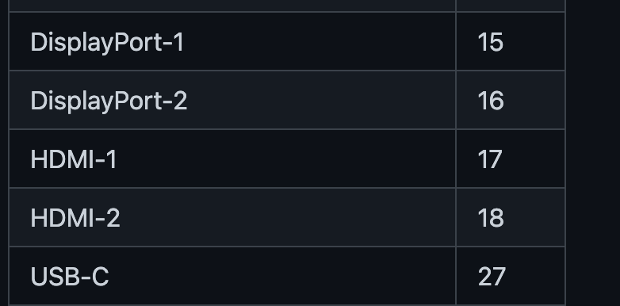
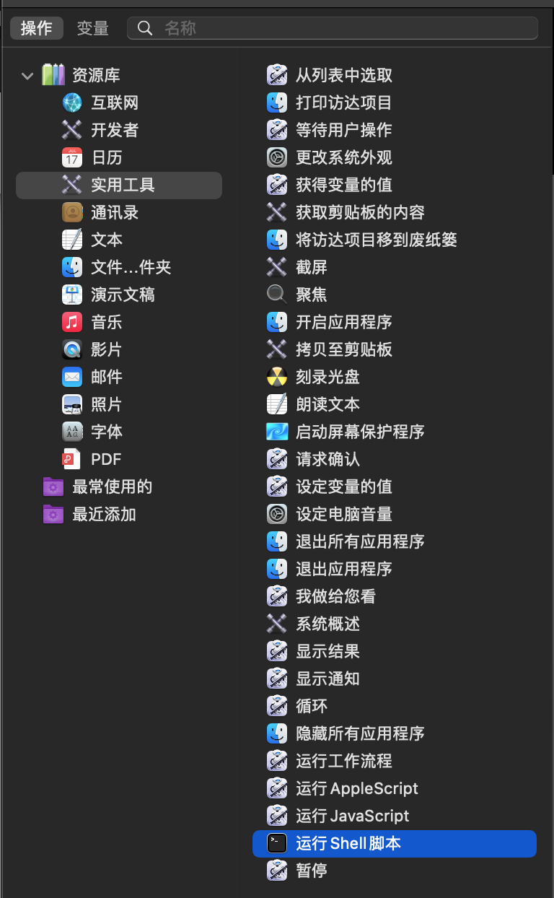

# 两台电脑之间”无缝“切换键鼠

本文内容主要介绍如何优雅地使用一套键鼠在两台电脑和一台显示器之间切换。（两台电脑连同一台显示器）

首先列一下我的设备：

1. 两台 mac 
2. 一台 27 寸 AOC 显示器
3. 京东京造 K8 键盘
4. magic trackpad

优雅标准：

1. 切换起码不能插拔连接线吧
2. 键盘快捷键一键切换
3. 切换成功率 99%

> 一些约定：
>
> 下文中的切换键盘指的是：同一键盘在两台电脑之间切换
>
> 下文中的切换妙控板指的是：同一妙控板在两台电脑之间切换

## 优雅标准第一阶段

第一阶段就是解决切换过程中需要插拔电脑和显示器的连接线，键鼠和电脑的连接线。这里只根据我的设备的情况来展开。

设备连接情况：

- 显示器和电脑用 typec 和 hdmi 两根线连接
- 键盘和妙控板通过蓝牙和电脑连接

> hdmi 连接线需要 hdmi-typec 的线才能达到 4k 60hz。市面上的拓展坞只能支持到 4k 30hz

### 切换显示器输入源

当我们用两根线连接了显示器和两台电脑后，可以直接通过按显示器实体键来切换输入源。但是这优雅吗，这不优雅。一番 Google 后找到一个在 mac 平台上通过命令行来控制显示器的库 [ddcctl，](https://github.com/kfix/ddcctl#ddcctl-ddc-monitor-controls-for-the-osx-command-line)具体的安装步骤以及环境要求可以参考 `ddcctl` 的文档。

安装完成之后我们就可以通过命令行来控制显示器的输入源了：

```shell
# port 是显示器对应输入源的端口号
ddcctl -d 1 -i port
```

常用输入源可能的端口号：



更多参考 [ddcctl - Input Source](https://github.com/kfix/ddcctl#input-sources)。USB-C的端口号可能每个显示器都不太一样，对于我这台 AOC U27N3C 来说， HDMI2 对应 18，USB-C对应 15，表格中的 27 是在 Dell 显示器中测出来的，所以使用该库是可能需要自己测试一下找到自己显示器输入源对应的端口号。

拿到输入源对应的端口号后，就可以在终端中切换显示器的输入源了。好了，这离我们用键盘来切换显示器的输入源又近了一步。

到现在，我们思路基本就是按下快捷键后，执行 shell 命令。有借助一些键盘映射软件，然后添加一些配置实现的，本文中介绍一种利用 mac 自动操作来实现按下快捷键后执行 shell 命令的方法：

打开自动操作后选择新建文稿，在左侧新找到运行脚本：



拖到右侧区域之后，输入切换显示器信号源的命令，这里输入切换信号源到 HDMI2 的命令：`ddcctl -d 1 -i 18`，点击运行，测试一下是否切换成功。如果出现如下错误：


需要添加一行代码，完整内容如下：

```shell
export PATH=/usr/local/bin:$PATH
ddcctl -d 1 -i 18
```

`Command+S`保存自动操作，之后在系统偏好设置->键盘->快捷键，服务那一栏找到我们定义的自动操作名称，添加快捷键即可。

至此，就实现了通过键盘来切换显示器输入源的需求。

我是两台 mac ，所以只要把上述操作在两台电脑上都做一下即可，如果有些朋友有 windows 的需求，可以参考[通过键盘控制显示器输入源的切换](https://blog.i-ll.cc/archives/587) 中 windows 的部分。

### 切换键盘

京东京造支持蓝牙和有线两种方式连接，蓝牙最多可以连接 3 个设备，所以为了满足优雅标准的第一阶段，选择蓝牙连接是一定的。

只需要将键盘和两台电脑配对，然后通过 `Fn+1` `Fn+2` `Fn+3` 来切换蓝牙连接的设备就行了，非常的方便。


### 切换妙控板

买妙控板之前以为已经可以做到像 AirPods 一样，在同一 appleID 的不同设备可以自动切换，妹想到啊。

切换妙控板我使用的是 [AIrbuddy2](https://v2.airbuddy.app/)，这款软件 UI 可以说是非常精美，主要的功能是在 mac 上实现类似 AirPods 在 iPhone 和 iPad 上的弹窗效果，其中有一个 magic handoff 的功能，可以在多台 mac 之间切换苹果的一些外设。

好了，8 说了，已经下单了


具体使用参考官网教程。这里说一下这个软件切换妙控板时的一些问题：

1. 不能使用快捷键把某个外设转移到某台电脑上
2. 如果两台设备不是登录的同一个 appleId 的话，两台 mac 之间要用蓝牙连接，可能会导致妙控板卡顿，连接不稳定。
3. 可能会转移失败

做完这些工作，基本上可以达到优雅标准第一阶段的顶级了。目前存在一个问题：当我们想要从一台电脑切换到另一台电脑时，需要依次做如下操作：

1. 切换妙控板，点点点。
2. 切换显示器输入源
3. 切换键盘蓝牙连接

这体验说实话，在没有失误的情况下，比插拔线可能快上一丢丢。

> 因为我有一台 mac 是合盖连接到显示器的，所以在切换显示器输入源和切换妙控板时偶尔会失败，然后就比较麻烦了

所以在优雅标准第二阶段我们首先就是需要把三个操作一步到位的完成，然后想办法提高成功率

## 优雅标准第二阶段

啊，我也没搞好啊，那没事了

想过利用「自动操作」中的「我做给您看」来实现


但是录制完成后，经常在 Airbuddy2 这里出现 error，而且没有找到如何 debug 这东西的方法，只能暂且搁置，不过我依然觉得这是一种可行的方法。

然后还给 Airbuddy2 的 support center 发邮件，希望他们可以给转移外设的添加快捷键，目前还没回复我，如果转移妙控板可以添加快捷键，感觉实现优雅标准第二阶段就有更多可能了。

## 优雅标准第三阶段

上文中也提到在切换显示器输入源和切换妙控板时偶尔会失败，失败后的体验贼差，所以需要有一种几乎不可能失败的方案。

目前怀疑失败的原因是有台 mac 是合盖的状态（桌子空间不够，只能合盖）


最后总结一下，目前对于一套键鼠在两台电脑和一台显示器之间切换，只实现了优雅标准第一阶段，第二第三阶段更像是我的展望。然后如果大家也有这方面的需求，那首先一定要挑好外设，无缝切换主要靠硬件堆[doge]。

后续有进展再更新吧，最后附上一张桌面图

